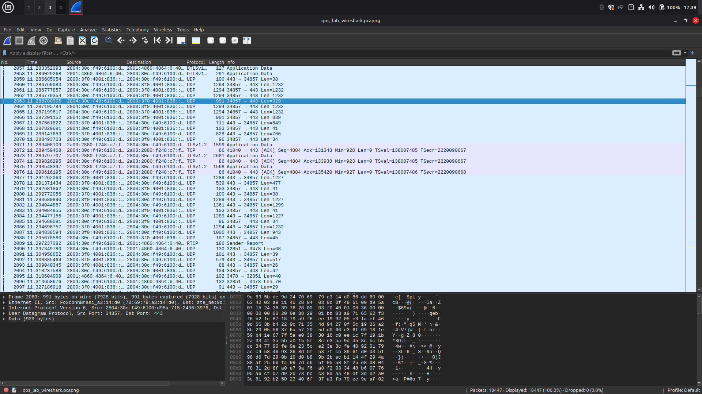
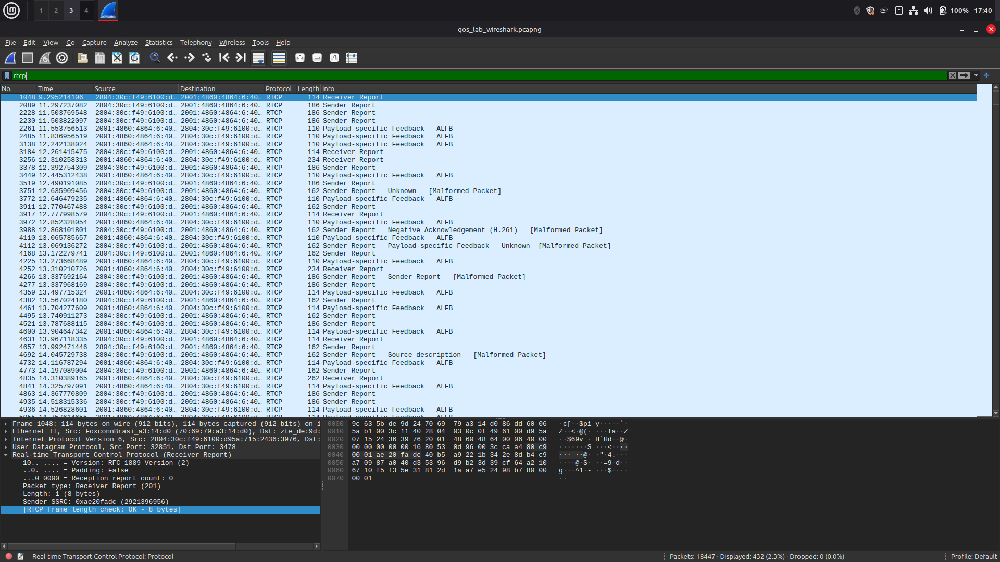
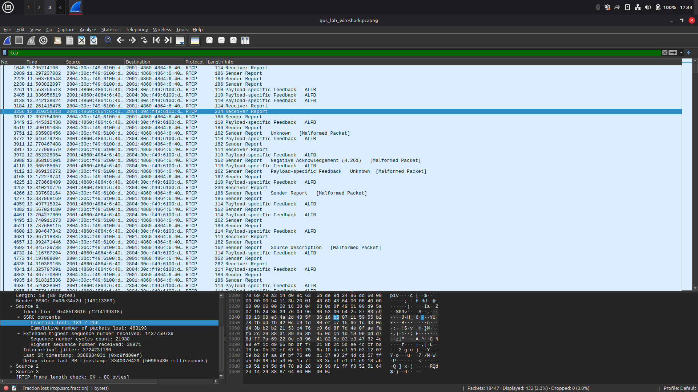

# Relatório de Laboratório: Qualidade de Serviço (QoS) - A Otimização da Jornada dos Pacotes

**Disciplina:** Redes de Computadores II \
**Professora:** Angelita Rettore de Araujo \
**Nome do Aluno:** Matheus dos Santos Wogt \
**Turma:** Ciências da Computação 6ª fase

---

## 1. Introdução

Este laboratório aborda a **Qualidade de Serviço (QoS)**, um conjunto de mecanismos importantes para gerenciar o tráfego de rede e assegurar que aplicações críticas recebam tratamento preferencial. Diferente dos laboratórios anteriores que focaram na confiabilidade (garantir que os pacotes cheguem), o objetivo aqui é garantir que os pacotes cheguem *com qualidade* – ou seja, com a latência, jitter, throughput e perda de pacotes adequados.

A importância da QoS é contextualizada pela **narrativa da telecirurgia**, onde cada pacote de comando tátil, voz ou dado vital do paciente é crucial. Atrasos, variações irregulares na chegada ou perda de pacotes podem ter consequências catastróficas.

## 2. Objetivos

Os principais objetivos deste laboratório são:
1.  **Compreender e medir** os conceitos fundamentais de Latência, Jitter, Throughput, Perda de Pacotes e Classificação de Tráfego no contexto de QoS.
2.  **Configurar e executar simulações** no **Network Simulator 2 (NS2)** para observar o comportamento da rede sob diferentes condições de QoS.
3.  **Utilizar o Wireshark** para capturar e analisar o tráfego de rede, medindo parâmetros de QoS em tempo real.
4.  **Analisar o impacto** da variação dos parâmetros de QoS no desempenho de diferentes tipos de aplicações.
5.  **Comparar a tolerância a perdas e a sensibilidade à latência e jitter** de diversas aplicações.
6.  **Propor soluções** baseadas em QoS para otimizar o desempenho de aplicações críticas em cenários de rede desafiadores.

## 3. Ferramentas Utilizadas

*   **Network Simulator 2 (NS2)**: Ambiente de simulação de rede para modelar cenários.
*   **Wireshark**: Analisador de protocolo de rede para captura e inspeção de pacotes em tempo real.
*   **Acesso à Internet**: Para testes com ferramentas online (como Google Meet).

---

## 4. Parte I: Relembrando a Jornada – Preparando o Ambiente

**Contexto Teórico:** A narrativa da cirurgia remota é a base para entender a importância dos "pacotes heróis" (Pablo, Melody, Flash e Data) e como a QoS é vital para a missão deles de salvar uma vida.

### **4.1. Verificação e Configuração Inicial do NS2**


### **4.2. Configuração Inicial do Wireshark**

*   Abri o Wireshark e selecionei a interface de rede correta para captura.

**Entrega:** Captura de tela do Wireshark com a interface de captura selecionada.


---

## 5. Parte II: Latência (Delay) – O Tempo é Essencial

**Contexto Teórico:** A latência é o tempo que um pacote leva para ir da origem ao destino, como o tempo para o comando tátil do Dr. Martinez (Flash) chegar ao bisturi em Manaus.

### **5.1. Simulação de Latência no NS2**

*   Criei e executei o script `lab_latencia.tcl`, experimentando diferentes valores para `link_delay` (ex: 10ms, 100ms, 500ms).

**Entrega:** O código `lab_latencia.tcl` utilizado.
```tcl
# lab_latencia.tcl
# Simulação de Latência (Delay)
# 1. Importação do Arquivo Base
source qos_base.tcl
# 2. Criação dos Nós
set n0 [$ns node]
set n1 [$ns node]
# 3. Criação do Link com Latência Variável
# Experimente diferentes valores para o delay (ex: 10ms, 100ms, 500ms)
set link_delay "100ms" ;# Latência do link
create_link $n0 $n1 $default_bw $link_delay $default_queue
# 4. Criação dos Agentes e Aplicações
set udp0 [new Agent/UDP]
$ns attach-agent $n0 $udp0
set cbr0 [new Application/Traffic/CBR]
$cbr0 attach-agent $udp0
$cbr0 set packetSize_ 1000
$cbr0 set interval_ 0.01 ;# 100 pacotes/segundo
set null0 [new Agent/Null]
$ns attach-agent $n1 $null0
$udp0 set class_ 0 ;# Para identificação no trace
$ns connect $udp0 $null0
# 5. Agendamento de Eventos
$ns at 0.5 "$cbr0 start"
$ns at 4.5 "$cbr0 stop"
$ns at 5.0 "finish"
# 6. Início da Simulação
$ns run

```

### **5.2. Análise da Latência no Arquivo de Trace (.tr)**

*   Analisei o arquivo `lab_latencia.tr`, identificando o envio e recebimento de pacotes para calcular a latência de ponta a ponta.

**Entrega:** Trecho do arquivo `.tr` destacando um pacote enviado e seu respectivo recebimento.
```
+ 0.5 0 1 cbr 1000 ------- 0 0.0 1.0 0 0
r 0.608 0 1 cbr 1000 ------- 0 0.0 1.0 0 0
```

**Cálculos da Latência:**

| `link_delay` Configurado | Timestamp Envio | Timestamp Recebimento | Latência Calculada |
| :----------------------- | :-------------- | :-------------------- | :----------------- |
| 10ms   | 0.5         | 0.518               | 0.018        |
| 100ms  | 0.5         | 0.608               | 0.108       |
| 500ms  | 0.5         | 1.008               | 0.508        |

### **5.3. Perguntas para Refletir e Discutir**

1.  **Qual a relação entre o `link_delay` configurado no script e a latência medida no arquivo `.tr`?**
    *   O **link_delay** é o tempo que demora para atravessar esse link, logo quanto maior o link_delay maior será a latência, até é possível ver que a latência na tabela acima é quase igual ao link_delay tendo uma margem de erro de 0.008 que seria o atraso do processamento em ambas as pontas do link
2.  **Como a latência afeta a percepção do usuário em aplicações como VoIP ou jogos online?**
    *   Em ambos os casos o usuário perceberia se houvesse uma latência alta, especificamente:
        * **VoIP**: através da resposta atrasada do outro lado do telefone que conforme mais latência mais demorada seria
        * **jogos online**: através do atraso dos controles pois ao clicar em algo demoraria para que essa ação fosse concluída, também a atualização do movimento de outros jogadores por exemplo seria demorada e com travamentos e teleportes
    * Em ambos o usuário só perceberia a latência caso ela excedesse um ponto que de fato seria visível, segundo o material da Professora essa latência máxima decente seria de 150ms
3.  **Se o Dr. Martinez estivesse em Tóquio e o paciente em Manaus, qual seria o impacto na latência?**
    *   Atrasos na imagem e nos comandos do Dr. Martinez poderiam levar a ações que não deveriam ser feitas e isso poderia acabar por acontecer algum acidente na cirurgia, como o médico realizar um movimento mas os pacotes demorarem para chegar ao outro lado e o movimento que tinha que ser nanométrico pode arruinar a vida do paciente

---

## 6. Parte III: Jitter e Perda de Pacotes – A Variação Inesperada e o Preço da Imperfeição

**Contexto Teórico:** **Jitter** é a variação no atraso dos pacotes, causando "voz robotizada" (pacotes de Melody). A **perda de pacotes** ocorre quando um pacote não chega, sendo a tolerância variável por aplicação (pacotes de Data). O **RTCP (Real-Time Control Protocol)** é utilizado por aplicações em tempo real (como Google Meet) para reportar a qualidade da transmissão, incluindo jitter e perda.

### **6.1. Análise do Jitter e Perda de Pacotes no Wireshark (Captura Local de RTCP)**

*   Iniciei uma chamada no Google Meet e capturei o tráfego com o Wireshark.
*   Filtrei o tráfego por `rtcp` e identifiquei os tipos de pacotes (SR, RR, SDES, Bye).
*   Analisei os **Receiver Reports (RR)** para localizar os campos `Fraction Lost`, `Cumulative Number of Packets Lost` e `Interarrival Jitter`.

**Entregas:**

1.  Captura de tela do Wireshark mostrando a captura inicial de pacotes.
    
2.  Captura de tela do Wireshark mostrando o filtro `rtcp` aplicado.
    
3.  Captura de tela dos detalhes de um pacote **Receiver Report (RR)**, com os campos `Fraction Lost`, `Cumulative Number of Packets Lost` e `Interarrival Jitter` claramente visíveis.
    

**Valores Observados:**

Número do pacote utilizado: 3256

*   **Interarrival Jitter:** 3724231180 originalmente mas acredito que traduzindo para ms ficaria 37.24231180
*   **Fraction Lost:** 181/256 ou 70.703125 (ou % se convertido)
*   **Cumulative Number of Packets Lost:** 463193
### **6.2. Perguntas para Refletir e Discutir**

1.  **Como esses valores de Jitter e Fraction Lost se comparam aos limites aceitáveis para uma boa qualidade de voz/vídeo (ex: jitter idealmente abaixo de 30ms, perda abaixo de 1%)?**
    *   Comparando usando os valores passados pela professora no tópico "Quality of Service (QoS) em Redes de Computadores" podemos entender que:
        - Jitter: atual apresentando 37ms ainda está dentro dos 40ms máximo que foi apresentado para vídeoconferências
        - Fraction Lost: atual apresentando 70.70% sendo que o ideal para vídeoconferências seria menos de 1%, portanto muito acima do decente
2.  **Por que o RTCP é essencial para aplicações em tempo real, mesmo que o RTP (dados de mídia) esteja criptografado?**
        - Ele faz o envio de pacotes de controle assim trocando informações como jitter, tempo de ida e volta entre outros, para que os aplicativos nas pontas decidam o que fazer.
3.  **Como as informações de jitter e perda de pacotes reportadas pelo RTCP podem ser usadas pela aplicação (Google Meet) para ajustar a qualidade da transmissão?**
        - Caso fosse detectado um congestionamento na rede (jitter ou fraction lost muito altos) ele pode diminuir a qualidade do vídeo para diminuir a quantidade de pacotes trafegando pela rede e assim estabilizar a videoconferência mesmo que à uma qualidade menor ela ficaria mais estabilizada do que anteriormente, caso seja detectado bons números de jitter e fraction lost pode ser que a qualidade seja aumentada automaticamente para atender melhor a demanda de qualidade.

---

## 7. Parte IV: Throughput vs. Responsividade – O Dilema da Rede

**Contexto Teórico:** **Throughput** é a quantidade de dados em um tempo (Pablo/vídeo HD), enquanto **responsividade** é a rapidez da resposta (Flash/comando tátil). Nem sempre é possível ter ambos em níveis máximos simultaneamente.

### **7.1. Simulação de Throughput e Responsividade no NS2**

*   Criei e executei o script `lab_throughput_responsividade.tcl`, comparando o comportamento de FTP (alto throughput) com Ping (alta responsividade).

**Entrega:** O código `lab_throughput_responsividade.tcl` utilizado.
```tcl
# lab_throughput_responsividade.tcl
# Simulação de Throughput vs. Responsividade
# 1. Importação do Arquivo Base
source qos_base.tcl
$ns color 1 blue
$ns color 2 red
# 2. Criação dos Nós
set n0 [$ns node]
set n1 [$ns node]
set n2 [$ns node]
set n3 [$ns node]
# 3. Criação dos Links
# Link principal com capacidade limitada para observar congestionamento
create_link $n0 $n1 "10Mb" "10ms" $default_queue
create_link $n1 $n2 "10Mb" "10ms" $default_queue
create_link $n1 $n3 "10Mb" "10ms" $default_queue
# 4. Aplicação de Alto Throughput (FTP)
set tcp_ftp [new Agent/TCP]
$ns attach-agent $n0 $tcp_ftp
$tcp_ftp set fid_ 1 ;
set ftp [new Application/FTP]
$ftp attach-agent $tcp_ftp
set sink_ftp [new Agent/TCPSink]
$ns attach-agent $n2 $sink_ftp
$ns connect $tcp_ftp $sink_ftp
# Define uma implementação Tcl para o método 'recv' do Agent/Ping.
Agent/Ping instproc recv {from rtt} {
$self instvar node_
puts "node [$node_ id] received ping answer from \
$from with round-trip-time $rtt ms."
}
# 5. Aplicação de Alta Responsividade (Ping - ICMP)
set ping_agent [new Agent/Ping]
$ns attach-agent $n0 $ping_agent
$ping_agent set fid_ 2 ;
set ping_sink [new Agent/Ping]
$ns attach-agent $n3 $ping_sink
$ping_sink set fid_ 2 ;
$ns connect $ping_agent $ping_sink
# 6. Agendamento de Eventos
$ns at 0.5 "$ftp start"
$ns at 1.0 "$ping_agent send" ;# Envia um ping
$ns at 1.3 "$ping_agent send" ;# Envia outro ping
$ns at 1.6 "$ping_agent send" ;# Envia outro ping
$ns at 1.9 "$ping_agent send" ;# Envia outro ping
$ns at 2.2 "$ping_agent send" ;# Envia outro ping
$ns at 2.5 "$ping_agent send" ;# Envia outro ping
$ns at 2.8 "$ping_agent send" ;# Envia outro ping
$ns at 3.1 "$ping_agent send" ;# Envia outro ping
$ns at 3.4 "$ping_agent send" ;# Envia outro ping
$ns at 3.7 "$ping_agent send" ;# Envia outro ping
$ns at 4.5 "$ftp stop"
$ns at 5.0 "finish"
# 7. Início da Simulação
$ns run
```

### **7.2. Análise do Throughput e Responsividade**

*   Analisei o arquivo `lab_throughput_responsividade.tr` para calcular o throughput do FTP e a latência de cada ping.

**Cálculos Detalhados do Throughput do FTP:**

Usando o regex "r [0-5].[0-9]{6} 1 2 tcp" foi encontrado:

*   Número de pacotes TCP recebidos: 1619
*   Tamanho do pacote TCP (padrão NS2): 1040 bytes
*   Tempo total da simulação para FTP (stop - start): 4 segundos
*   Throughput = (Número de pacotes * Tamanho do pacote) / Tempo
*   Throughput (em Kbps/Mbps): (1619 * 1,04) / 4 = 420,94  Kbps

**Cálculos da Latência para cada pacote Ping e Impacto do FTP:**

| Ping Nº | Timestamp Envio | Timestamp Recebimento | Latência (ms) | Observações sobre o Impacto do FTP |
| :------ | :-------------- | :-------------------- | :------------ | :--------------------------------- |
| 1       | 1               | 1.041005              | 0.041005      | Não houve nenhum impacto do FTP sobre o ping |
| 2       | 1.3             | 1.34064               | 0.04064       | Não houve nenhum impacto do FTP sobre o ping |
| ...     | ...             | ...                   | ...           | ...                                |

### **7.3. Perguntas para Refletir e Discutir**

1.  **Qual aplicação (FTP ou Ping) é mais sensível à latência? Por quê?**
    *   O ping não manda dados significativos para que a latência seja algo significativo, mas o FTP caso haja uma latência grande é perceptível pois a transferência de arquivos será mais lenta, sendo assim o FTP é mais sensível à latência
2.  **Como o throughput do FTP foi afetado pela capacidade do link?**
    *   A capacidade do link define o quanto de throughput o FTP pode ter, no melhor dos casos caso apenas ele ocupe o link inteiro então o throughtput será algo bem próximo à capacidade do link
3.  **Em um cenário de telecirurgia, qual seria a prioridade: alto throughput para o vídeo HD (Pablo) ou alta responsividade para os comandos do bisturi (Flash)? Justifique.**
    *   Para os comandos, pois caso o vídeo trave o médico pode parar de mexer no robo-cirurgião e esperar o vídeo voltar. Se os comandos não responderem como o médico quer então pode ser que algum movimento que não deveria acontecer ocorra e isso é um risco em potencial para o paciente.

---

## 8. Parte V: Perda de Pacotes – O Preço da Imperfeição

**Contexto Teórico:** A perda de pacotes ocorre quando um pacote não chega ao destino. A tolerância a essa perda varia drasticamente entre as aplicações, como os dados vitais do paciente (Data).

### **8.1. Simulação de Perda de Pacotes no NS2**

*   Criei e executei o script `lab_perda.tcl`, ajustando a taxa de erro de bit (`rate_`) para diferentes valores (ex: 1e-2, 1e-5) no `ErrorModel`.

**Entrega:** O código `lab_perda.tcl` utilizado.
```tcl
# lab_perda.tcl
# Simulação de Perda de Pacotes
# 1. Importação do Arquivo Base
source qos_base.tcl
# 2. Criação dos Nós
set n0 [$ns node]
set n1 [$ns node]
# 3. Criação do Link e Configuração do Modelo de Erro
create_link $n0 $n1 $default_bw $default_delay $default_queue
# >>> INÍCIO DA CONFIGURAÇÃO DO MODELO DE ERRO (ErrorModel) <<<
set em [new ErrorModel]
# Taxa de erro de bit (BER): 1 erro a cada 100 bits (1e-2 = 0.01)
# Você pode ajustar este valor para controlar a frequência das perdas.
# Uma BER de 1e-2 é bem alta, resultando em muitas perdas.
# Para perdas mais sutis, experimente valores como 1e-5 ou 1e-6.
$em set rate_ 1e-2
$em set unit_ bit
# Anexa o modelo de erro a AMBAS as direções do link (n0 para n1 e n1 para n0)
$ns lossmodel $em $n0 $n1
$ns lossmodel $em $n1 $n0
# >>> FIM DA CONFIGURAÇÃO DO MODELO DE ERRO <<<
# 4. Criação dos Agentes e Aplicações (UDP - Tolerante a perdas)
set udp0 [new Agent/UDP]
$ns attach-agent $n0 $udp0
set cbr0 [new Application/Traffic/CBR]
$cbr0 attach-agent $udp0
$cbr0 set packetSize_ 500
$cbr0 set interval_ 0.01
set null0 [new Agent/Null]
$ns attach-agent $n1 $null0
$ns connect $udp0 $null0
# 5. Criação dos Agentes e Aplicações (TCP - Intolerante a perdas)
set tcp0 [new Agent/TCP]
$ns attach-agent $n0 $tcp0
set ftp0 [new Application/FTP]
$ftp0 attach-agent $tcp0
set sink0 [new Agent/TCPSink]
$ns attach-agent $n1 $sink0
$ns connect $tcp0 $sink0
# 6. Agendamento de Eventos
$ns at 0.5 "$cbr0 start"
$ns at 0.5 "$ftp0 start"
$ns at 4.5 "$cbr0 stop"
$ns at 4.5 "$ftp0 stop"
$ns at 5.0 "finish"
# 7. Início da Simulação
$ns run
```

### **8.2. Análise da Perda de Pacotes no Arquivo de Trace (.tr)**

*   Analisei o arquivo `lab_perda.tr` para calcular a taxa de perda de pacotes UDP e observar o comportamento do TCP.

**Cálculos da Taxa de Perda de Pacotes UDP:**

| `rate_` Configurado (ErrorModel) | Pacotes UDP Enviados | Pacotes UDP Recebidos | Pacotes Perdidos | Taxa de Perda (%) |
| :------------------------------- | :------------------- | :-------------------- | :--------------- | :---------------- |
| 1e-2                             | 1500                 | 1120                  | 380              | 25,33333333%      |
| 1e-5                             | 1516                 | 1119                  | 397              | 26,18733509%      |

**Descrição do Comportamento do TCP:**
- O TCP tem throughput bem menor porém ele tem mais garantia de entrega, no meu não encontrei nenhum ACK e nenhum pacote de retransmissão
### **8.3. Perguntas para Refletir e Discutir**

1.  **Qual protocolo (UDP ou TCP) é mais afetado pela perda de pacotes em termos de entrega final? Por quê?**
    *   Temos duas abordagens para este caso dependendo do que é priorizado:
        *   Throughput: TCP pois acaba por atrasar bastante qual é de fato o envio de pacotes afinal alguns podem se perder ou até mesmo ACK's e então diminuindo a quantia de carga útil trafegando pela rede
        *   Entrega confiável: UDP pois caso pacotes se percam eles não podem ser recuperados, com o TCP isso não acontece pois ele garante a entrega de todos os pacotes
2.  **Como a taxa de perda configurada no script (`rate_`) se compara à taxa de perda observada para o UDP?**
    *   No script o "rate_" é uma taxa de erro a cada 100 bits portanto a ideia é de que quanto maior a taxa maior seria a perda no UDP, porém no meu aconteceu o inverso eu acredito que por apenas coincidência de que com a taxa menor acabou por ter a taxa de perda um pouco maior, para análise dos pacotes em ambos os rate_ foi utilizado o mesmo regex 
3.  **Dê exemplos de aplicações que toleram alta perda de pacotes e aplicações que não toleram nenhuma perda.**
    *   Aplicações que utilizam UDP como videochamadas, VoIP, jogos online, podem ter uma taxa de perda de pacotes e a utilização do serviço ainda ser decente.
    *   Aplicações que utilizam TCP como download de arquivos do drive, mandar mensagens por whatsapp, entre outros, que não podem perder nenhum dado afinal não faz sentido ler uma mensagem que chegou pela metade.

---

## 9. Parte VI: Consolidação e Perspectivas Futuras

### **Síntese do Aprendizado**

*   [Escreva uma síntese dos principais aprendizados sobre a relação entre os parâmetros de QoS (latência, jitter, throughput, perda) e o desempenho de diferentes aplicações, utilizando os resultados dos experimentos. Faça um link com a **narrativa da telecirurgia** e proponha uma **solução baseada em QoS** para otimizar o desempenho das aplicações críticas nesse cenário desafiador (vídeo HD, comandos táteis, voz, dados do paciente).]
Latência é o tempo de espera até um pacote ir do emissor até o receptor, quanto menor melhor, é importante para serviços críticos como cirurgias à distância, e até mesmo VoIP e jogos online. \
Jitter é a variação da latência em uma comunicação, como a latência pode mudar de um pacote para outro essa taxa de mudança representa uma variação na chegada dos pacotes podendo influenciar a camada de aplicação significantemente, como uma reunião no google meet que fica travando mas só as vezes, nesses momentos a latência acaba ficando muito alta, e para poder mitigar o google meet por exemplo pode usar o jitter para diminuir a qualidade do vídeo da reunião fazendo com que menos pacotes tenham que percorrer a rede e consequentemente diminuindo a latência. \
Throughput é a quantidade de dados por medida de tempo (ex: Mbps) passando através da rede. \
Responsividade é a rapidez da resposta à uma ação feita pelo emissor, a exemplo seria um jogo online onde o jogador clica para se mexer e o quão rápido essa ação é enviada para o servidor e este retorna uma resposta. \
Perda de pacotes ocorre quando os pacotes mandados pelo emissor não conseguem chegar ao receptor por N motivos, a depender da implementação eles podem ou não ser recuperados, TCP faz isso naturalmente, UDP normalmente não faz porém caso seja necessário pode ser implementado protocolos auxiliares para recuperação de pacotes.

No cenário da cirurgia é importante que o médico tenha uma latência e jitter baixos para que o vídeo da tele-cirurgia não trave, precisa de uma excelente responsividade para que não seja realizado movimentos que podem acabar pondo o paciente em risco, e a perda de pacotes pode acontecer com o vídeo desde que seja em uma taxa dentro do esperado.

---

**Instruções Finais para os Alunos:**
*   Preencha todas as seções marcadas com `[ ]` com suas informações e análises.
*   Converta este arquivo Markdown para PDF para a entrega final, garantindo que todas as imagens e formatações estejam corretas.

---